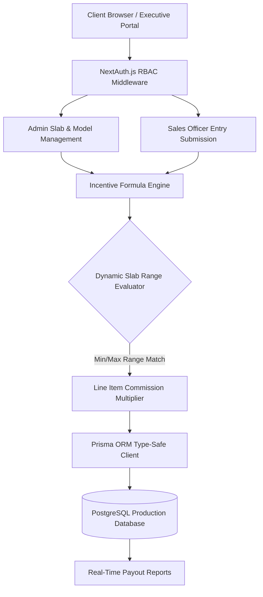

# 🚀 Smart Incentive Calculator (SIC)

[](https://nextjs.org/)
[](https://www.typescriptlang.org/)
[](https://www.postgresql.org/)
[](https://www.prisma.io/)
[](https://tailwindcss.com/)
[](https://smart-incentive-calculator-gamma.vercel.app/)

> **An enterprise-grade, full-stack incentive calculation & performance management engine built with Next.js App Router, TypeScript, and PostgreSQL.** Designed for automotive dealerships and enterprise sales teams to automate multi-tiered commission logic, eliminate manual payout discrepancies, and streamline executive oversight through real-time role-based portals.

---

## 🌐 Live Application
👉 **[Launch Smart Incentive Calculator Live Demo](https://smart-incentive-calculator-gamma.vercel.app/)**

---

## 💡 System Architecture



---

## ✨ Enterprise Core Capabilities

| Feature Module | Technical Highlights | Impact |
| :--- | :--- | :--- |
| **Dynamic Slab Evaluator** | Configurable min/max volume thresholds with unbounded upper limits (`maxRange: null`). | Computes tier-based incentives dynamically without hardcoded code changes. |
| **Role-Based Access Control (RBAC)** | Strict NextAuth JWT session validation segregating `ADMIN` and `SALES_OFFICER` roles. | Guarantees data isolation and prevents unauthorized tier modifications. |
| **Automated Incentive Engine** | Instant calculation of commissions on monthly sales entries upon submission. | Reduces monthly payroll reconciliation time from days to sub-second transactions. |
| **Atomic Database Transactions** | PostgreSQL unique constraints (`@@unique([month, year, carModelId])`) and Prisma cascade deletes. | Prevents duplicate sales submissions and guarantees zero financial ledger drift. |
| **Responsive Executive Dashboard** | Modern glassmorphism UI built with Radix UI primitives, Lucide icons, and Tailwind CSS. | Delivers clear visual metrics for both field representatives and management. |

---

## ⚡ Mathematical Incentive Logic

The engine evaluates payout rates dynamically based on monthly volume tiers:

$$	ext{Total Incentive} = 	ext{Units Sold} 	imes 	ext{Slab Rate}(	ext{Units Sold})$$

$$	ext{where } 	ext{Slab Rate}(Q) = S.	ext{incentiveAmount} \quad 	ext{for } S.	ext{minRange} \le Q \le 	ext{coalesce}(S.	ext{maxRange}, \infty)$$

---

## 🛠️ Tech Stack & Tooling

* **Framework**: Next.js 14 (App Router, Server Actions, Route Handlers)
* **Language**: TypeScript (100% strict type safety)
* **Database & ORM**: PostgreSQL, Prisma ORM
* **Authentication**: NextAuth.js (JWT strategy, bcrypt password hashing)
* **Styling & UI Components**: Tailwind CSS, Radix UI, Lucide Icons, Hook Form, Zod Validation

---

## 🚀 Local Developer Setup

### Prerequisites
* **Node.js**: `v18.x` or `v20.x`
* **PostgreSQL**: Local or hosted database (e.g. Neon, Supabase, AWS RDS)

### Installation
```bash
# 1. Clone the repository
git clone https://github.com/KrishnaKanhaiya1/Smart-Incentive-Calculator.git
cd Smart-Incentive-Calculator

# 2. Install dependencies
npm install

# 3. Configure environment variables
cp .env.example .env

# 4. Generate Prisma Client & Run Database Migrations
npx prisma generate
npx prisma db push

# 5. Seed initial demo data (Car Models, Tiers, Users)
npm run prisma:seed

# 6. Launch development server
npm run dev
```

---

## 📄 License & Contact

Distributed under the MIT License. Developed by **[Krishna Kanhaiya](https://github.com/KrishnaKanhaiya1)**.
